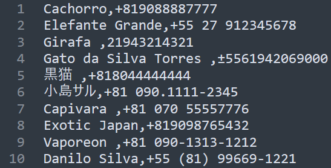
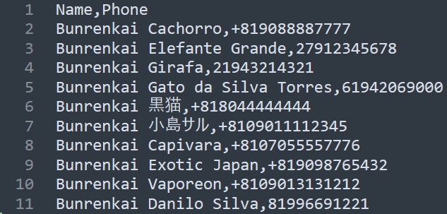

# Script de Formatação de Telefones para o Bunrenkai
A partir de um arquivo de telefones .csv, cria outro arquivo de telefones .csv, na formatação correta.

## Formatação Inicial:

## Formatação Resultante:

## Dependências
O programa não tem dependências.

## Pré-Execução
Para gerar o arquivo "telefones.csv" inicial, vá ao formulário de inscrição do Bunrenkai, na seção de respostas, e clique o botão "ver respostas no Sheets."

No Sheets, selecione as colunas "Nome Completo" e "Qual é o seu número de celular para contato?," clicando nas letras acima. Segurando a tecla Ctrl e clicando nos cabeçalhos, remova-os da seleção. Copie a seleção.

Clique o botão em formato de "+" no canto inferior esquerdo da tela para criar uma nova tabela. Nela, cole a seleção. Então, no menu "Arquivo" baixe o arquivo com a extensão .csv, renomeando-o para "telefones.csv"

## Execução
O arquivo "script_telefones_bunrenkai.exe" deve ser executado de dentro de uma pasta, com um arquivo "telefones.csv" inicial.

Um arquivo "saida.csv" será criado.

## Próximos Passos
Para terminar o processo, acesse o [Google Contacts](https://contacts.google.com/) e importe o arquivo "saida.csv" como tabela de contatos. Caso os contatos do seu celular não estejam sincronizados com o seu gmail, faça-o.

Então, pelo celular, vá ao grupo do Bunrenkai, à aba de Adicionar Membro, e adicione os contatos. Talvez demore alguns minutos para os contatos aparecerem.

Após adicionar os contatos, volte ao Google Contacts e delete a categoria "Importado em [data]," clicando na opção "Deletar os contatos e a categoria."

## Contato
Caso encontre algum problema ou erro, favor entrar em contato pelo email abaixo.

## Meta
Lucas Mendonça Emery Cade – luemerycade@gmail.com

Esse programa está disponibilizado pela GNU General Public License 3.
